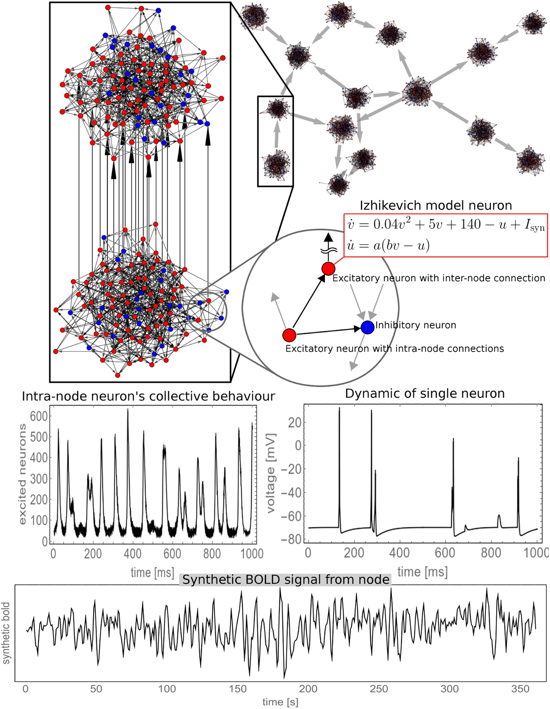

# izhik2bold

## Overview

"izhik2bold" is a computational model that simulates Blood Oxygen Level Dependent (BOLD) activity based on a complex network of Izhikevich neurons. This project bridges the gap between neural spiking activity and BOLD signals observed in functional MRI (fMRI), offering insights into the dynamic interplay between neuronal behavior and blood oxygenation.

## Model Description



*Figure: Model Visualization. With permission from [Nature Scientific Reports](https://www.nature.com/articles/s41598-018-23996-x).*

### Neuronal Dynamics

The simulation utilizes the Izhikevich model, characterized by two primary variables: the membrane potential (v) and a recovery variable (u). The Izhikevich model is formulated as follows, with `v` representing the membrane potential in mV, and `u` representing the recovery variable:

```
dv/dt = 0.04v^2 + 5v + 140 - u + I
du/dt = a(bv - u)
```

When `v` reaches the peak of 30mV, `v` and `u` are reset according to `v = c` and `u = u + d`, introducing heterogeneity among neurons by varying the parameters `(a, b, c, d)`.

### Synaptic Conductance Dynamics

The model incorporates synaptic conductance dynamics with four receptor types: AMPA, NMDA, GABAA, and GABAB. The conductance for each receptor type follows its dynamics, significantly affecting the simulation of neuronal interactions and BOLD signal generation.

### Network Architecture

The neural network is structured into nodes, each simulating 1000 neurons with a 1:4 ratio of inhibitory to excitatory neurons. The simulation ensures infra-node heterogeneity and complex inter-node interactions, reflecting the diverse functionalities within the neocortex.

### BOLD Dynamics

The BOLD signal, `y`, is modeled to reflect changes in blood flow and oxygenation in response to neural activity, relying on the balloon model for cerebral blood dynamics. Key equations include the relationships between venous volume `V`, deoxyhemoglobin content `q`, and other parameters influencing BOLD signals:

```
dy/dt = V^(1/alpha) - V0^(1/alpha)
```

### Neurovascular Coupling

The model introduces a neurovascular signal `s`, responsible for the modulation of blood inflow `fin`, as a function of neural activity. This aspect links the neural model directly to the hemodynamic responses observed in BOLD fMRI.

## Numerical Values for Constant Parameters

The simulation utilizes specific values for various parameters to accurately replicate neuronal and BOLD dynamics. Here's a summary table of these parameters:

| Name | Value | Unit |
|------|-------|------|
| Uexc | 0.5   | ms^-1 |
| Fexc | 1000  | ms   |
| Dexc | 800   | ms   |
| Uinh | 0.2   | ms^-1 |
| ...  | ...   | ...  |

(Complete the table based on the provided document details.)

## References

For more information on the concepts and models used in this project, see the following publication:

- [Dynamics of blood flow and oxygenation changes during brain activation: The balloon model. Nature Scientific Reports](https://www.nature.com/articles/s41598-018-23996-x)

